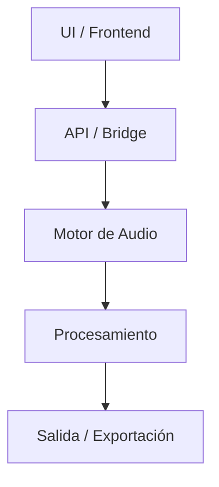

# Auralis™


🎛 Plataforma de codificación de audio para **creación, modelado, codificación y reproducción** multicanal.

***

# 📊 Estado del Proyecto


**Progreso general del desarrollo**

🟦🟦🟦🟦🟦🟦🟦⬜⬜⬜ 70%

> [!TIP]
> El progreso se calcula en base a módulos funcionales completados e integración del sistema.

---

## 🧩 Progreso por Módulos

| Módulo             | Estado                 |
| ------------------ | ---------------------- |
| Motor de Audio     | 🟦🟦🟦🟦🟦🟦🟦🟦⬜⬜ 80% |
| Interfaz (UI)      | 🟦🟦🟦🟦🟦🟦🟦⬜⬜⬜ 70%  |
| Integración App    | 🟦🟦🟦🟦🟦🟦🟦🟦⬜⬜ 80% |
| Funcionalidades    | 🟦🟦🟦🟦🟦⬜⬜⬜⬜⬜ 50%    |
| Build/Distribución | 🟦🟦🟦🟦🟦🟦⬜⬜⬜⬜ 60%   |

---

# ✨ Características

### 🎧 Motor de Audio

* Procesamiento multicanal
* Soporte para audio basado en objetos
* Pipeline de procesamiento modular
* Codificación interna: 
  - PWARE
* Codificación externa:
  - DMAE
  - DEE
  - FLAE
  - OPUE

### 🧩 Arquitectura

* Diseño modular y escalable
* Separación clara entre backend y frontend
* Integración con aplicaciones de escritorio

### 🌐 Integración

* APIs internas
* Comunicación entre módulos
* Preparado para expansión futura

---

# 🏗️ Arquitectura



---

# 🚀 Estado de Desarrollo

```text
Fase actual: Desarrollo avanzado
Estado: Arquitectura sólida, funcionalidades en expansión
```

### 📌 Interpretación del progreso

| Rango   | Estado                |
| ------- | --------------------- |
| 0–30%   | 🟥 Etapa inicial      |
| 30–60%  | 🟧 En desarrollo      |
| 60–90%  | 🟨 Avanzado           |
| 90–100% | 🟩 Listo para release |

👉 Actualmente: **🟨 Fase avanzada**

---

# 🗺️ Roadmap (Resumen)

* [x] Base del motor de audio
* [x] Estructura del proyecto
* [x] Integración inicial UI
* [ ] Funcionalidades avanzadas de audio
* [ ] Optimización de rendimiento
* [ ] Sistema de despliegue
* [ ] Versión beta

---

# 📋 Changelog

Consulta el historial de cambios en:
👉 `CHANGELOG.md` | NO DISPONIBLE.

---

# 🤝 Contribución

Actualmente el proyecto no está abierto a contribuciones externas.

***

> [!IMPORTANT]
> Auralis™, Auralis Monitor™ y ORB: MOSA™ forman parte de un ecosistema en desarrollo por BDEV.


## 🧠 Nota

> [!NOTE]
> Proyecto personal. Se publicará cuando la beta esté lista.


---

# 📄 Licencia

**Copyright © 2026, BDEV. All rights reserved.**
